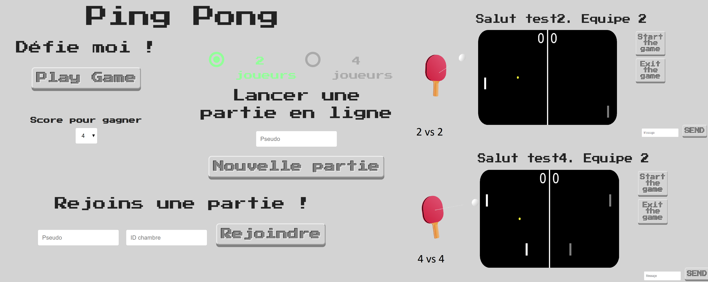

# Ping Pong 

Il s'agit d'un jeu de ping-pong qui a été développé pour un projet scolaire.

## Description

Vous pouvez jouer :
* contre __une IA__ assez intelligente ou d'autres joueurs en créant un jeu __en ligne__.
* en utilisant la __souris__.

## Commandes pour lancer l'application

A la racine du projet vous pouvez :

* Utilisez le gestionnaire de paquets [npm]

```bash
npm install
# Puis
npm start
```

## Technologies

* HTML5
* CSS
* JQUERY
* Node JS (Express JS)
* Socket.IO
* Chatter avec vos adversaires

## Interfaces


